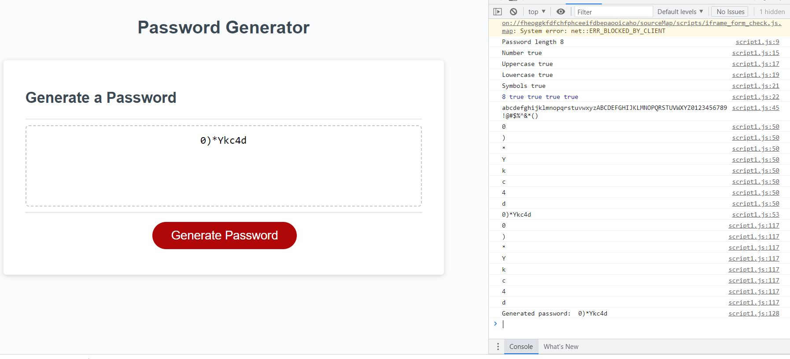

# Password Generator

## Description

For this assignment I was tasked with using a starter code to finish creating a random password generator. I used javascript to complete the assignment. This task would be very useful to achieve to learn how to make a function for the user to use in their everyday life. I was able to make it so the user could enter the desired characters they wanted to use including uppercase, numbers, symbols & lowercase. I was able to keep the parameters of the password length between 8 and 128 characters. If the user entered something lower or higher than these numbers then it would give them an alert of what went wrong and able to try again. This also works if any letters or symbols are entered as well.

## Installation

N/A

## Usage

This application will be used by the user so a random password can be created easily. This will help the user with security on their local device. It can be applied in ways to help protect the user and using random characters to create a completely unique password.

## Credits

N/A

## License

Please refer to the LICENSE in the repo.

## Criteria for assignment

GIVEN I need a new, secure password

*WHEN I click the button to generate a password*
**THEN I am presented with a series of prompts for password criteria**

*WHEN prompted for password criteria*
**THEN I select which criteria to include in the password**

*WHEN prompted for the length of the password*
**THEN I choose a length of at least 8 characters and no more than 128 characters**

*WHEN asked for character types to include in the password*
**THEN I confirm whether or not to include lowercase, uppercase, numeric, and/or special characters**

*WHEN I answer each prompt*
**THEN my input should be validated and at least one character type should be selected**

*WHEN all prompts are answered*
**THEN a password is generated that matches the selected criteria**

*WHEN the password is generated*
**THEN the password is either displayed in an alert or written to the page**

## Repository Link

[Github](https://github.com/PintoDrop/Challenge-3)

## Website Link

[Password Generator](https://pintodrop.github.io/Challenge-3/)

## Screen Shots

